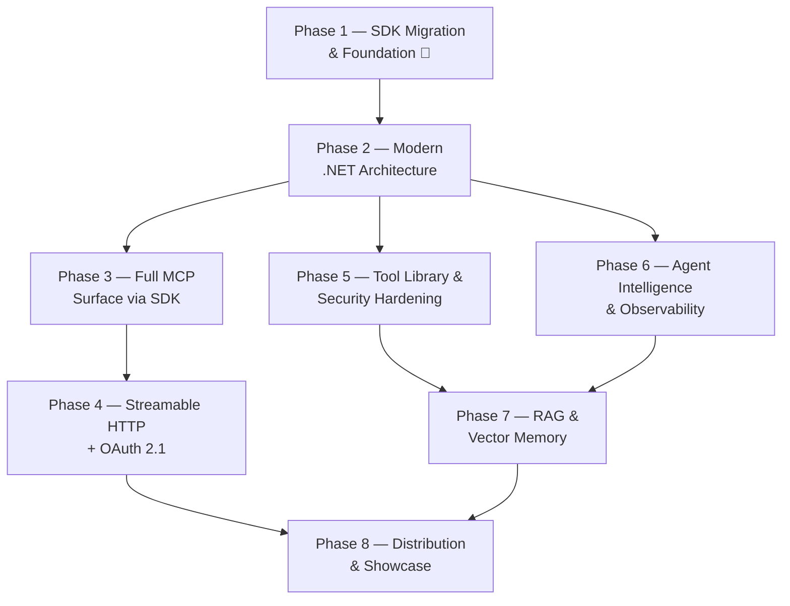

# Product Requirements Document — DotNetMcpServer

> **Status:** Approved · **Version:** 2.0 · **Last updated:** 2026-07-28
> **Owner:** Daniel Cruz · **Execution tracker:** [`PROGRESSO.md`](PROGRESSO.md)
>
> **v2.0 supersedes v1.0.** v1.0 kept the hand-written protocol as the production path. That decision was reversed — see [§4](#4-the-central-decision-sdk-first) and the decision log in `PROGRESSO.md`.

---

## 1. Vision & Positioning

**DotNetMcpServer is a production-shaped MCP server and AI agent in .NET 10, built on the official Tier 1 C# SDK — with a hand-written protocol implementation preserved alongside it as a study artifact, cross-validated against the SDK.**

The pitch is not "I implemented a protocol." It is:

> *"I implemented the MCP stdio transport by hand to understand it, proved it interoperates with the official client, and then shipped on the official SDK — because the spec ships a new revision every few months and I'd rather spend that time on tools, security, and observability. Here's the ADR."*

That story demonstrates two things instead of one: **depth** (you can read a spec and implement it) and **judgment** (you know when not to ship your own). The second is the scarcer signal, and it is the one that reads as senior.

### Target audience

| Audience | What they need to see |
|---|---|
| **Hiring managers / tech leads** | Idiomatic, tested, observable, deployable .NET — and evidence of good build-vs-buy judgment. |
| **Interviewers** | Depth on tap: protocol internals, async pipelines, DI, security boundaries, distributed tracing — each with a written rationale behind it. |
| **.NET developers learning MCP** | A realistic reference for building on the SDK, plus a readable from-scratch implementation for anyone who wants to see underneath it. |
| **The author** | A working system to keep learning on, not a frozen artifact. |

---

## 2. Problem Statement

An audit on 2026-07-28 found the project in good shape on the surface — 65 passing tests, green CI, a careful README, documented JSON-RPC examples, clean and consistent code — and structurally broken underneath.

### The headline defect

`JsonRpcStream` frames messages with a `Content-Length: N\r\n\r\n` header. That is the **Language Server Protocol** transport. The MCP specification requires the opposite:

> *"Messages are delimited by newlines, and **MUST NOT** contain embedded newlines."*
> — [MCP specification, stdio transport](https://modelcontextprotocol.io/specification/2025-06-18/basic/transports)

**Consequence:** the server does not connect to Claude Desktop, VS Code, Cursor, Claude Code, or any other MCP client. It only talks to the agent in this same repository, which speaks the same non-standard dialect. The two halves agree with each other and with nothing else.

### The scale of the gap

The audit produced **34 findings** across five categories. They compound: the protocol is wrong, the client silently drops messages it cannot correlate, the agent has zero test coverage, and the path-traversal guard fails on exactly the operating system CI runs on.

The good news: the codebase is small (~1,600 lines of `src`), cleanly separated into `Shared` / `Server` / `Agent`, and consistently written. Every finding is tractable — and as §4 explains, a third of them are about to become someone else's problem.

---

## 3. Current State Audit

34 findings, ordered by severity. Every line reference was verified against the tree at commit `1b5a8f1`.

### 🔴 Critical

| ID | Finding | Location |
|---|---|---|
| **C1** | `Content-Length` framing (LSP) instead of newline-delimited JSON (MCP). **No real MCP client can connect.** | `Shared/JsonRpc/JsonRpcStream.cs:31,45` |
| **C2** | `.gitignore` swallows `.env.example` via the `.env.*` pattern. The file exists on disk but **has never reached GitHub** — and the README links to it. Confirmed with `git check-ignore -v`. | `.gitignore:27` ↔ `README.md:111` |
| **C3** | Protocol version pinned to `2025-03-26` — two revisions behind the current stable `2025-11-25`. | `Server/Program.cs:10` |
| **C4** | `initialize` blindly echoes whatever version the client sent, instead of negotiating against a supported set. | `Server/Server/McpServerHost.cs:89-91` |
| **C5** | The MCP launch command is `dotnet run`, and MSBuild writes to **stdout** — the exact channel the protocol owns. The spec states the server *"MUST NOT write anything to its stdout that is not a valid MCP message."* Any build warning corrupts the stream. | `Agent/appsettings.json:10` |

> **C5 survives the SDK migration.** The SDK owns framing, not process launch. If the server is still started with `dotnet run`, MSBuild output still lands on the protocol channel. This one is on you regardless.

### 🟠 Architecture & correctness

| ID | Finding | Location |
|---|---|---|
| **A1** | The response-correlation loop **silently discards** any message whose `id` does not match the pending request — including server-initiated notifications. Breaks entirely under concurrent requests. | `Agent/Mcp/McpClient.cs:106-128` |
| **A2** | `Id?.GetValue<long>()` throws if the peer returns a string `id`, which JSON-RPC 2.0 explicitly permits. | `Agent/Mcp/McpClient.cs:116` |
| **A3** | The server awaits each request to completion before reading the next. One slow tool blocks the entire pipe. | `Server/Server/McpServerHost.cs:57-58` |
| **A4** | No `ping`, `notifications/cancelled`, `logging/*`, `resources/*`, `prompts/*`, `completion/*`, or progress notifications. `tools/*` only. | `Shared/Mcp/McpContracts.cs:6-12` |
| **A5** | The test project **does not reference the Agent project** → 0% coverage on `McpClient`, `OpenAiChatClient`, `InteractiveAgentRunner`, and `AgentSettingsLoader`. All 65 tests target Server/Shared. | `tests/DotNetMcpServer.Tests/DotNetMcpServer.Tests.csproj` |
| **A6** | No Generic Host, no DI, no `ILogger`, no `IOptions`. Logging is `Console.Error.WriteLine` scattered across layers. | `McpServerHost.cs:66,145`, `McpClient.cs:54` |
| **A7** | Conversation history grows without bound — there is an explicit `// TODO` acknowledging it. Will exceed the model's context window in a long session. | `Agent/Runtime/InteractiveAgentRunner.cs:34` |
| **A8** | Raw `new HttpClient()`: no `IHttpClientFactory`, no timeout, no retry/backoff, no handling of HTTP 429 `Retry-After`. | `Agent/Program.cs:24` |
| **A9** | `Console.ReadLine()` ignores the `CancellationToken`. Ctrl+C sets the token but the process stays blocked on the read. | `Agent/Runtime/InteractiveAgentRunner.cs:43` |
| **A10** | Exhausting `MaxToolIterations` throws, **killing the entire session** instead of degrading to a partial answer. | `Agent/Runtime/InteractiveAgentRunner.cs:90` |
| **A11** | Hard-coupled to the OpenAI Chat Completions shape. No `IChatClient` abstraction, no streaming, no token/cost accounting. | `Agent/Llm/OpenAiChatClient.cs` |
| **A12** | `ReadSingleByteAsync` allocates a fresh `byte[1]` **for every single byte read** — O(n) allocations per message, plus one `await` per byte. | `Shared/JsonRpc/JsonRpcStream.cs:115-125` |

### 🟡 Security

| ID | Finding | Location |
|---|---|---|
| **S1** | The workspace-containment check compares paths with `OrdinalIgnoreCase` — **incorrect on case-sensitive filesystems**, which is precisely where CI runs (ubuntu-latest). | `Tools/ReadTextFileTool.cs:98` |
| **S2** | No symlink resolution. A symbolic link *inside* the workspace pointing *outside* it passes the path-traversal guard cleanly. | `Tools/ReadTextFileTool.cs:87` |
| **S3** | `File.ReadAllTextAsync` loads the whole file into memory and truncates afterwards. A multi-gigabyte file exhausts memory before the limit is ever applied. | `Tools/ReadTextFileTool.cs:67` |
| **S4** | `DataTable.Compute` for expression evaluation: drags in `System.Data` and is not trim/AOT-safe. | `Tools/CalculateExpressionTool.cs:51` |
| **S5** | `appsettings.json` ships an `apiKey` field — an open invitation to commit a secret by accident. | `Agent/appsettings.json:4` |
| **S6** | No deny-list for sensitive paths (`.git/`, `.env`, `*.pem`, SSH keys), no rate limiting, no per-tool timeout. | `Server/Tools/` |

### 🔵 Build, CI & repository

| ID | Finding | Location |
|---|---|---|
| **B1** | No `Directory.Build.props`. TFM, `Nullable`, and `ImplicitUsings` are duplicated across four `.csproj` files. No `TreatWarningsAsErrors`, no analyzers, no deterministic builds. | repository root |
| **B2** | No `Directory.Packages.props` — package versions are not centrally managed. | repository root |
| **B3** | Both `DotNetMcpServer.sln` and `DotNetMcpServer.slnx` are tracked. CI uses only the `.slnx`; the `.sln` will drift silently. | repository root |
| **B4** | No `.gitattributes`, while `.editorconfig` mandates `end_of_line = lf` on a Windows development machine. | `.editorconfig:7` |
| **B5** | `coverlet.collector` is referenced but coverage is **never collected or published**. No `dotnet format --verify-no-changes`, ubuntu-only, no Dependabot, no CodeQL, no release job. | `.github/workflows/ci.yml` |
| **B6** | `Directory.CreateDirectory` as a constructor side effect — an unwritable path fails at object construction rather than at call time, and makes the type awkward to test. | `Tools/AppendStudyNoteTool.cs:14` |

### ⚪ Documentation & product

| ID | Finding |
|---|---|
| **D1** | README is Portuguese-only, with no demo GIF, no screenshot, and no install snippet for real MCP clients. |
| **D2** | No `docs/` directory, no ADRs, no `CONTRIBUTING.md`, `SECURITY.md`, or `CHANGELOG.md`. |
| **D3** | Error messages and comments are in Portuguese. Decision taken: migrate everything to English. |
| **D4** | Only four tools, all trivial. No `list_directory`, `write_text_file`, or `search_files`. |
| **D5** | No semantic versioning, no releases, no installable package. |

---

## 4. The Central Decision: SDK-First

### What changed from v1.0

v1.0 of this document kept the hand-written protocol as the production path, on the reasoning that it was the project's differentiator. That reasoning was re-examined and found weak on three counts:

1. **It optimized for differentiation over judgment.** Knowing what *not* to build is scarcer and more valuable in hiring than knowing how to build it. A reviewer seeing a hand-rolled protocol next to an official Tier 1 SDK has two available readings — "deep" or "didn't research" — and v1.0 did not price in the second.
2. **It under-weighted spec velocity.** v1.0's own risk table rated spec drift "High likelihood," then recommended the option most exposed to it. MCP has shipped four revisions in twenty months, and the `2026-07-28` release candidate landed the day of this audit. Tier 1 means the SDK tracks that treadmill. Hand-rolled means one person tracks it, forever, alone.
3. **It under-weighted opportunity cost.** v1.0 spent roughly fourteen days re-deriving resources, prompts, completion, and Streamable HTTP — around 30% of the roadmap on its least differentiated layer.

### The SDK

The [official C# SDK](https://github.com/modelcontextprotocol/csharp-sdk) is maintained in collaboration with Microsoft and classified **Tier 1** — the highest tier, shared only with TypeScript, Python, and Go — on the stated criteria of "feature completeness, protocol support, and maintenance commitment."

| Package | Role in this project |
|---|---|
| `ModelContextProtocol` | Server hosting + DI; the production server path |
| `ModelContextProtocol.Core` | Client APIs; the agent's MCP client |
| `ModelContextProtocol.AspNetCore` | Streamable HTTP transport (Phase 4) |

### The resolution: SDK as product, hand-written as artifact

- The **production server and agent** are built on the SDK.
- The **hand-written implementation** moves to `src/Mcp.Protocol.Handwritten/`, is corrected to be spec-compliant, keeps its conformance suite, and is **cross-validated by driving it with the official SDK client** (`F1-11`). It is explicitly scoped and explicitly frozen — a study artifact, not a dependency of anything shipped.
- **ADR-0001** (`F1-14`) tells the story in the repository, in writing.

This turns a defensive interview question into an offensive one. *"Why didn't you use the SDK?"* is a question you answer under pressure. *"I built it, then chose the SDK — here's the reasoning"* is a point you make on your own terms.

### What the SDK absorbs — and what it does not

**Absorbed** (seven findings stop being product concerns; they remain fixed once in the artifact):

`C1` framing · `C3` protocol version · `C4` version negotiation · `A1` response correlation · `A2` string ids · `A3` sequential dispatch · `A12` per-byte allocation

**Partially absorbed:** `A4` — the SDK supplies the plumbing for resources, prompts, logging, and completion; the handlers are still yours (Phase 3, now days rather than weeks).

**Not absorbed — the remaining 26 findings.** Every security finding (`S1`–`S6`) is your tool code, and the SDK secures none of it. Every architecture finding about the *agent* (`A5`–`A11`) is untouched. Every build, CI, and documentation finding stands.

> **The SDK solves the plumbing. It solves none of your actual engineering problems.** That is the honest framing, and it is why this roadmap gets *shorter* without getting *weaker*.

---

## 5. Goals & Non-Goals

### Goals

1. **Interoperate for real.** The server connects to Claude Desktop, VS Code, and Claude Code on the SDK path — and the hand-written artifact is proven to interoperate too.
2. **Look like senior .NET.** Generic Host, DI, `IOptions` with startup validation, structured logging, resilience policies, OpenTelemetry.
3. **Demonstrate judgment, in writing.** ADRs that make every non-obvious decision defensible.
4. **Be genuinely useful.** A tool library worth pointing a real agent at, behind a security boundary that holds under adversarial tests.
5. **Be installable in one line.** `dotnet tool install -g`.
6. **Stay current.** Spec revisions arrive as SDK version bumps, not as rewrites.

### Non-Goals

| Non-goal | Rationale |
|---|---|
| **Shipping the hand-written protocol as the production path** | Reversed in v2.0. It remains in the repository as a scoped, tested, documented study artifact — see §4. |
| **Extending the hand-written implementation to new spec revisions** | Its scope is frozen at stdio transport + JSON-RPC framing + core contracts. Growing it would recreate exactly the maintenance treadmill the SDK decision avoids. |
| Building a web UI | The console agent is sufficient signal. |
| Multi-tenancy or horizontal scale | Out of proportion for a portfolio piece. |
| Model training or fine-tuning | A different discipline entirely. |

---

## 6. Success Metrics

| Metric | Baseline (2026-07-28) | Target | Verified by |
|---|---|---|---|
| Connects to a real MCP client | ❌ No | ✅ Claude Desktop + VS Code + Claude Code | Manual + recorded demo |
| MCP protocol revision | `2025-03-26` | Current stable, tracked via SDK | `initialize` response |
| Hand-written artifact interoperates | ❌ No | ✅ Driven by the official SDK client in CI | Conformance suite |
| MCP capabilities served | tools only | tools + resources + prompts + logging + completion | Capability probe |
| MCP tools exposed | 4 | 12+ | `tools/list` |
| Tests | 65 | 200+ | `dotnet test` |
| Line coverage | Not measured | ≥ 80% | Coverlet → Codecov badge |
| Projects under test | 2 of 3 (Agent uncovered) | all | `.csproj` references |
| Build warnings | Not enforced | 0, `TreatWarningsAsErrors` | CI |
| CI platforms | ubuntu only | ubuntu + windows + macos | CI matrix |
| ADRs published | 0 | 4+ | `docs/adr/` |
| Installation | clone + `dotnet run` | `dotnet tool install -g` | Release workflow |
| README language | PT-BR only | English primary | — |

---

## 7. Roadmap

Eight phases. Each is independently demonstrable and leaves the repository presentable, so work can stop at any boundary without looking abandoned.

---

### Phase 1 — SDK Migration & Foundation 🔴

> **Goal: the server connects to Claude Desktop, and the hand-written implementation becomes a correct, documented artifact.**

**Why it matters.** This phase resolves seven findings by deletion and sets up the narrative the whole project now rests on. It also lands ADR-0001, which is the single highest-leverage document in the repository.

| ID | Task | Addresses |
|---|---|---|
| **F1-01** | Add `!.env.example` to `.gitignore` and commit the file, so the README link resolves | C2 |
| **F1-02** | Remove the `apiKey` field from `appsettings.json`; environment variable only | S5 |
| **F1-03** | Add `Directory.Build.props`: shared TFM, `Nullable`, `LangVersion`, `TreatWarningsAsErrors`, `EnforceCodeStyleInBuild`, `AnalysisLevel=latest-all`, deterministic builds | B1 |
| **F1-04** | Add `Directory.Packages.props` (Central Package Management) — the mechanism that makes SDK version bumps a one-line change | B2 |
| **F1-05** | Add `.gitattributes` with `* text=auto eol=lf`, matching `.editorconfig` | B4 |
| **F1-06** | Delete `DotNetMcpServer.sln`; keep `.slnx` as the single source of truth | B3 |
| **F1-07** | Migrate the server to `ModelContextProtocol`: host builder, DI-registered tools, stdio transport | C1, C3, C4, A3 |
| **F1-08** | Migrate the agent's MCP client to `ModelContextProtocol.Core` | A1, A2 |
| **F1-09** | Relocate the hand-written implementation to `src/Mcp.Protocol.Handwritten/`, referenced by nothing shipped, with its scope documented as frozen | — |
| **F1-10** | Correct the artifact: newline-delimited framing via `System.IO.Pipelines` + `Utf8JsonReader`; assert no embedded newline is ever emitted | C1, A12 |
| **F1-11** | **Cross-validate the artifact against the official SDK client** — drive the hand-written server with an SDK-based client in CI and assert full interop | C1, C3, C4 |
| **F1-12** | Launch the compiled binary instead of `dotnet run`, so MSBuild output never reaches the protocol stream | C5 |
| **F1-13** | Verify in Claude Desktop, VS Code, and Claude Code; write `docs/INSTALL.md` | D1 |
| **F1-14** | **Write ADR-0001** — hand-written vs official SDK: what was built, what was measured, why the SDK ships, why the artifact stays | D2 |

**Deliverables** — an SDK-based server and agent that connect to real clients, plus a corrected, interop-proven, clearly-scoped hand-written artifact and the ADR that frames it.

**Acceptance criteria**
- `claude mcp add` connects and `tools/list` returns all four tools.
- Claude Desktop shows the server connected and invokes every tool.
- A CI test drives the **hand-written** server with the **official SDK** client and completes a full handshake plus tool call.
- `dotnet build` produces zero warnings with `TreatWarningsAsErrors` enabled.
- `git ls-files` includes `.env.example`.
- ADR-0001 is committed and answers the question without hedging.

**Dependencies:** none. **Estimated effort:** 3–4 days.

---

### Phase 2 — Modern .NET Architecture 🟠

> **Goal: the code reads like a senior .NET engineer wrote it.**

**Why it matters.** The largest remaining signalling gap. A reviewer opening `Program.cs` today finds manual object graphs and `Console.Error.WriteLine`. The SDK pushes the *server* toward DI naturally; the **agent** gets none of that for free, and the agent is where most of these findings live.

| ID | Task | Addresses |
|---|---|---|
| **F2-01** | Adopt `Microsoft.Extensions.Hosting` in the agent, matching the server's SDK-provided host | A6 |
| **F2-02** | Bind configuration with `IOptions<T>` + `ValidateDataAnnotations().ValidateOnStart()` | A6 |
| **F2-03** | Structured `ILogger` logging. **In the server, the logger writes to stderr only** — stdout belongs to the protocol | A6, C5 |
| **F2-04** | `IHttpClientFactory` + `Microsoft.Extensions.Http.Resilience`: retry with jittered backoff, total timeout, circuit breaker, HTTP 429 `Retry-After` | A8 |
| **F2-05** | Move directory creation out of `AppendStudyNoteTool`'s constructor into an injected workspace service | B6 |
| **F2-06** | Make console input cancellable so Ctrl+C interrupts cleanly | A9 |
| **F2-07** | Degrade gracefully at the tool-iteration limit — return a partial answer instead of discarding the session | A10 |
| **F2-08** | Reference the Agent project from the test project and cover the runner, settings loader, and LLM client | A5 |
| **F2-09** | Migrate all comments, error messages, and log output to English | D3 |

**Deliverables** — a hosted, injectable, observable, testable codebase with no untested project.

**Acceptance criteria**
- No `new` on a service type in either entry point.
- A missing `OPENAI_API_KEY` fails at startup with a clear validation message, not at first request.
- A transient HTTP 429 is retried transparently, proven by a test with a stub handler.
- Coverage ≥ 60% with every project reporting.
- No Portuguese strings remain in `src/`.

**Dependencies:** Phase 1. **Estimated effort:** 3–4 days.

---

### Phase 3 — Full MCP Surface via SDK 🟠

> **Goal: serve every MCP capability, not just tools.**

**Why it matters.** Tools are the easy third of MCP. Resources and prompts are what separate a demo from an implementation. On the SDK this is days of handler work rather than weeks of protocol work — which is precisely the trade the v2.0 decision bought.

| ID | Task | Addresses |
|---|---|---|
| **F3-01** | `resources/list` + `resources/read` — expose workspace documents as first-class resources | A4 |
| **F3-02** | Resource templates with RFC 6570 URI templates | A4 |
| **F3-03** | `resources/subscribe` + update notifications, backed by a `FileSystemWatcher` | A4 |
| **F3-04** | `prompts/list` + `prompts/get` — reusable study and analysis templates with arguments | A4 |
| **F3-05** | `completion/complete` — argument autocompletion for prompts and resource templates | A4 |
| **F3-06** | `logging/setLevel` + log notifications for client-controlled server verbosity | A4 |
| **F3-07** | Progress notifications for long-running tools | A4 |
| **F3-08** | `outputSchema` + structured content, plus tool annotations (`readOnlyHint`, `destructiveHint`, `idempotentHint`, `openWorldHint`) | A4 |
| **F3-09** | **Elicitation** — let a tool ask the user for missing input mid-execution | — |
| **F3-10** | **Sampling** — let the server request an LLM completion from the client | — |

**Deliverables** — full server-side capability coverage, including two features (elicitation, sampling) that almost no .NET example implements.

**Acceptance criteria**
- Claude Desktop lists resources and prompts alongside tools.
- Editing a workspace file triggers an update notification the client receives.
- A long-running tool reports incremental progress visible in the client.
- An elicitation round-trip completes against a real client.
- Every advertised capability is exercised by a test.

**Dependencies:** Phase 2. **Estimated effort:** 3–4 days.

---

### Phase 4 — Streamable HTTP + OAuth 2.1 🔵

> **Goal: a genuinely remote MCP server, deployable and authenticated.**

**Why it matters.** stdio servers are local. Streamable HTTP with OAuth is how MCP is deployed in production, and it connects this project to real backend engineering. The SDK provides the transport; **the authorization work is still entirely yours**, and that is the part worth demonstrating.

| ID | Task | Addresses |
|---|---|---|
| **F4-01** | Add `ModelContextProtocol.AspNetCore` and expose the MCP endpoint over Streamable HTTP | — |
| **F4-02** | Session management and SSE streaming verified end to end | — |
| **F4-03** | Resumability: event IDs + `Last-Event-ID` replay after a dropped connection | — |
| **F4-04** | **Spec-mandated security:** validate the `Origin` header (DNS-rebinding defence) and bind to localhost by default | S6 |
| **F4-05** | OAuth 2.1 resource server: protected-resource metadata (RFC 9728), `WWW-Authenticate` challenge, JWT bearer validation | — |
| **F4-06** | Per-tool authorization scopes, enforced before dispatch | S6 |
| **F4-07** | Multi-stage `Dockerfile` + `docker-compose.yml` with a local identity provider | D5 |
| **F4-08** | Run the full conformance and capability suite against **both** transports from a single test theory | — |

**Deliverables** — a containerized, authenticated, remotely reachable MCP server passing the same suite as stdio.

**Acceptance criteria**
- The suite runs green against both transports from one parameterized test.
- A missing or invalid token returns HTTP 401 with a correct `WWW-Authenticate` header.
- A request with a forged `Origin` is rejected.
- A dropped SSE connection resumes from `Last-Event-ID` without message loss.
- `docker compose up` yields a working server.

**Dependencies:** Phase 3. **Estimated effort:** 5–6 days.

---

### Phase 5 — Tool Library & Security Hardening 🟡

> **Goal: tools worth pointing a real agent at, behind a boundary that actually holds.**
>
> **The SDK contributes nothing to this phase.** Every line is yours — which is exactly why it carries more signal than the protocol work it replaced.

**Why it matters.** Four trivial tools do not demonstrate much. More importantly, the current path guard has two real holes, and *"I found and fixed a symlink escape in my own path-traversal check"* is a far better interview story than *"I wrote a file reader."*

| ID | Task | Addresses |
|---|---|---|
| **F5-01** | `list_directory` — paginated listing with glob filtering | D4 |
| **F5-02** | `write_text_file` — guarded writes with a dry-run mode | D4 |
| **F5-03** | `search_files` — regex/glob content search with context lines | D4 |
| **F5-04** | `git_log` and `git_diff` — read-only repository inspection | D4 |
| **F5-05** | `http_fetch` with a domain allowlist, response size cap, and SSRF protections | D4 |
| **F5-06** | Fix path comparison: case-sensitive on Linux/macOS, case-insensitive on Windows | S1 |
| **F5-07** | Resolve symlinks with `ResolveLinkTarget` and reject any link escaping the workspace | S2 |
| **F5-08** | Stream file reads with a hard byte cap instead of `ReadAllTextAsync`; guard against splitting surrogate pairs on truncation | S3 |
| **F5-09** | Deny-list for sensitive paths: `.git/`, `.env*`, `*.pem`, `id_rsa*`, `*.pfx` | S6 |
| **F5-10** | Per-tool timeouts and rate limiting via `System.Threading.RateLimiting` | S6 |
| **F5-11** | Replace `DataTable.Compute` with a hand-written Pratt parser — removes `System.Data`, becomes trim/AOT-safe, adds unary minus, `%`, `^`, and functions | S4 |

**Deliverables** — 12+ tools and a path boundary with adversarial tests behind it.

**Acceptance criteria**
- A symlink inside the workspace pointing to `/etc/passwd` (or `C:\Windows\System32\drivers\etc\hosts`) is rejected, proven by a test.
- Path-traversal tests pass on all three CI platforms, case-sensitivity cases included.
- Reading a 1 GB file respects the character cap without loading it into memory.
- The expression parser has property-based tests and depends on no `System.Data` type.

**Dependencies:** Phase 2. **Estimated effort:** 5–6 days.

---

### Phase 6 — Agent Intelligence & Observability 🔵

> **Goal: see inside the agent, and make it good enough to be worth watching.**

**Why it matters.** A distributed trace spanning `agent → LLM → MCP → tool` is one of the strongest single screenshots a portfolio can carry — it shows systems thinking, not feature work. The agent is also the half of this project the SDK does not shape, so it is where your design choices are most visible.

| ID | Task | Addresses |
|---|---|---|
| **F6-01** | Adopt `Microsoft.Extensions.AI` `IChatClient` as the LLM abstraction | A11 |
| **F6-02** | Pluggable providers: OpenAI, Azure OpenAI, Anthropic, Ollama — selected by configuration | A11 |
| **F6-03** | Streaming responses rendered token-by-token in the console | A11 |
| **F6-04** | Context-window management: sliding window plus summarization of evicted turns — closes the `TODO` at `InteractiveAgentRunner.cs:34` | A7 |
| **F6-05** | Token and cost accounting per turn and per session | A11 |
| **F6-06** | OpenTelemetry traces with a custom `ActivitySource`, spanning agent → LLM → MCP → tool | — |
| **F6-07** | Metrics: tool latency histograms, call counts, error rates, token throughput | — |
| **F6-08** | BenchmarkDotNet suite comparing the hand-written transport against the SDK's — a measured, publishable result the artifact makes possible | A12 |
| **F6-09** | Source-generated JSON serialization for trim/AOT safety and faster startup | — |
| **F6-10** | Native AOT publish + `docker-compose` with the .NET Aspire Dashboard for local OTLP | — |

**Deliverables** — a fully traced agent, a benchmark suite with published numbers, and an AOT binary.

**Acceptance criteria**
- One trace in the Aspire Dashboard shows the full path from user prompt to tool execution and back.
- Benchmarks are committed with numbers in the README.
- The Native AOT server starts in under 50 ms and passes the full suite.
- A 100-turn conversation stays within the model's context window without failing.

> Order matters: **F6-09 before F6-10.** Reflection-based serialization fails under AOT trimming.

**Dependencies:** Phase 2 (Phase 5 recommended). **Estimated effort:** 6–7 days.

---

### Phase 7 — RAG & Vector Memory 🟣

> **Goal: the agent remembers, and answers from a corpus larger than its context window.**

**Why it matters.** RAG is the most requested applied-AI skill on .NET job postings, and it is the natural endpoint of a project that already owns both the tool layer and the retrieval surface.

| ID | Task | Addresses |
|---|---|---|
| **F7-01** | `IEmbeddingGenerator` integration with a local model option, so the demo runs without API spend | — |
| **F7-02** | Vector store: SQLite-vec on disk, with an in-memory option for tests | — |
| **F7-03** | Ingestion pipeline: workspace → chunking with overlap → embedding → index, incremental on file change | — |
| **F7-04** | `search_knowledge` MCP tool — semantic search with score thresholds and citation of source spans | D4 |
| **F7-05** | Hybrid retrieval: vector similarity + BM25 keyword, with reciprocal-rank fusion | — |
| **F7-06** | Persistent conversation memory across sessions, scoped per workspace | A7 |
| **F7-07** | Retrieval evaluation harness using `Microsoft.Extensions.AI.Evaluation` with a fixed question set | — |

**Deliverables** — a working local RAG pipeline exposed through MCP, with measured retrieval quality.

**Acceptance criteria**
- Indexing `examples/workspace/` and asking a question surfaces the correct document with a citation.
- The evaluation harness reports recall@5 with a committed baseline.
- The full RAG demo runs offline with a local embedding model.
- Restarting the agent preserves prior conversation memory.

**Dependencies:** Phases 5 and 6. **Estimated effort:** 7–9 days.

---

### Phase 8 — Distribution & Showcase ⚪

> **Goal: the work becomes visible and installable. This is where a portfolio project pays off.**

**Why it matters.** Everything before this is invisible to someone browsing GitHub for ninety seconds. The demo GIF, the one-line install, the coverage badge, and the ADR index are what convert a visitor into a reader.

| ID | Task | Addresses |
|---|---|---|
| **F8-01** | Package the server as a `dotnet tool` — `dotnet tool install -g` | D5 |
| **F8-02** | CI matrix across ubuntu, windows, and macos | B5 |
| **F8-03** | Enforce `dotnet format --verify-no-changes` in CI | B5 |
| **F8-04** | Collect coverage with Coverlet, publish to Codecov, add the badge | B5 |
| **F8-05** | Release workflow: semantic versioning, GitHub Releases, signed artifacts, SBOM | D5 |
| **F8-06** | Rewrite the README in English: demo GIF (VHS or asciinema), architecture diagrams, install snippet, badge row — **leading with the SDK path, with the hand-written artifact as a "how it works underneath" section** | D1, D3 |
| **F8-07** | Record the demos: agent session, Claude Desktop integration, distributed trace | D1 |
| **F8-08** | Write the remaining ADRs: Streamable HTTP, the Pratt parser, the RAG retrieval strategy | D2 |
| **F8-09** | Add `CONTRIBUTING.md`, `SECURITY.md`, and `CHANGELOG.md` | D2 |
| **F8-10** | Enable Dependabot and CodeQL — Dependabot is what keeps the SDK current with no effort | B5 |
| **F8-11** | Publish a DocFX documentation site to GitHub Pages | D2 |

**Deliverables** — an installable, documented, badged, demonstrable project.

**Acceptance criteria**
- `dotnet tool install -g` works on a clean machine and the server connects to Claude Desktop.
- The README opens with a GIF of a real agent session.
- CI is green on all three platforms with coverage above 80%.
- Every ADR answers a question an interviewer would plausibly ask.

**Dependencies:** Phases 4 and 7. **Estimated effort:** 4–5 days.

---

## 8. Risks & Mitigations

| Risk | Impact | Likelihood | Mitigation |
|---|---|---|---|
| **The hybrid reads as indecisive rather than deliberate** | High | Medium | ADR-0001 (`F1-14`) and the README structure (`F8-06`) make the narrative explicit. The artifact is scoped, frozen, and labelled — never presented as a competing implementation. |
| **SDK major-version churn breaks the build** | Medium | Medium | Central Package Management (`F1-04`) makes a bump a one-line change; Dependabot (`F8-10`) surfaces it early; the capability suite catches behavioural regressions. |
| **The hand-written artifact rots and starts to embarrass** | Medium | Medium | Its scope is a declared non-goal to extend (§5). CI keeps it honest via the SDK-client cross-validation (`F1-11`) — if it breaks, CI says so. |
| **Phase 1 migration is larger than estimated** | Medium | Low | Only four tools to port, all with existing tests. The tests are the safety net and do not move. |
| **Phase 7 API costs** | Medium | Medium | A local embedding model is a Phase 7 acceptance criterion, not an afterthought. The demo must run offline. |
| **Phase 4 widens the attack surface** | High | Medium | The spec's security requirements (`Origin` validation, localhost binding, token validation) are explicit tasks with their own acceptance criteria. |
| **Scope fatigue stalls the roadmap mid-way** | High | Medium | Every phase ends presentable. Stopping after Phase 3 still leaves a strong, coherent project. |
| **Native AOT breaks reflection-based serialization** | Medium | Medium | `F6-09` lands before `F6-10`, deliberately. |

---

## 9. Out of Scope

- Web or desktop UI — the console agent is sufficient signal.
- Multi-tenancy, horizontal scaling, or managed hosting.
- Model training or fine-tuning.
- Extending the hand-written artifact beyond its frozen scope.
- Publishing the hand-written implementation as a NuGet package — it is a study artifact, and shipping a redundant protocol library would undercut the very judgment this document argues for.

---

## 10. References

- [MCP SDKs and tiering](https://modelcontextprotocol.io/docs/sdk) — the C# SDK is Tier 1, alongside TypeScript, Python, and Go
- [modelcontextprotocol/csharp-sdk](https://github.com/modelcontextprotocol/csharp-sdk) — maintained in collaboration with Microsoft
- [MCP specification — Transports](https://modelcontextprotocol.io/specification/2025-06-18/basic/transports) — the newline-delimited framing requirement behind C1
- [MCP specification — 2025-11-25](https://modelcontextprotocol.io/specification/2025-11-25) — current stable revision
- [RFC 9728 — OAuth 2.0 Protected Resource Metadata](https://datatracker.ietf.org/doc/html/rfc9728)
- [Microsoft.Extensions.AI](https://learn.microsoft.com/dotnet/ai/microsoft-extensions-ai) — the `IChatClient` abstraction adopted in Phase 6
