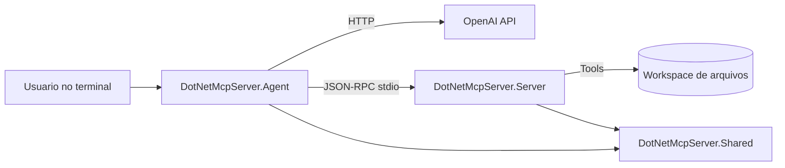

# DotNetMcpServer - AI Agent + MCP com .NET 10

[](https://github.com/danielcruzdev/dotnet-mcp-server/actions/workflows/ci.yml)
[](LICENSE)

Projeto completo de estudo e portfólio com **AI Agent** + **MCP (Model Context Protocol)**, implementado do zero em **.NET 10**.

A solução contém:
- Um **agente de IA em console** que conversa com o modelo e executa tool-calling.
- Um **MCP Server** via `stdio` (JSON-RPC com `Content-Length`) com ferramentas reais.
- Uma biblioteca **Shared** com contratos MCP/JSON-RPC reutilizáveis.
- Testes unitários e de cenário cobrindo ferramentas e o protocolo.

## Objetivo do projeto

Este repositório foi pensado para:
- Servir como material de estudo de arquitetura de agentes.
- Demonstrar integração prática entre LLM + ferramentas externas.
- Ser um projeto apresentável em portfólio GitHub.

## Stack

- .NET SDK `10.0.x`
- C# (nullable habilitado)
- JSON-RPC 2.0 sobre `stdio`
- OpenAI Chat Completions API (tool-calling)
- xUnit para testes

## Arquitetura



### Fluxo resumido

1. O agente inicia e sobe o MCP Server como processo filho.
2. Faz handshake MCP (`initialize` + `notifications/initialized`).
3. Lista ferramentas com `tools/list`.
4. Envia pergunta do usuário para o modelo com o schema das tools.
5. Quando o modelo pede uma tool, o agente chama `tools/call`.
6. O retorno da tool volta para o modelo até obter resposta final.

## Estrutura do repositório

```text
.
├─ examples/
│  ├─ EXAMPLES.md               # Guia de uso das ferramentas e do protocolo
│  ├─ workspace/                # Arquivos de exemplo para usar com read_text_file
│  │  ├─ dotnet-concepts.md
│  │  ├─ csharp-snippets.md
│  │  ├─ tasks.md
│  │  └─ budget-q1-2026.txt
│  └─ jsonrpc/                  # Mensagens JSON-RPC brutas (request + response)
│     ├─ 01-initialize-request.json
│     ├─ 02-initialize-response.json
│     └─ ... (15 arquivos no total)
├─ src/
│  ├─ DotNetMcpServer.Shared/   # Contratos JSON-RPC + MCP
│  ├─ DotNetMcpServer.Server/   # Servidor MCP (stdio)
│  └─ DotNetMcpServer.Agent/    # Agente de IA em console
├─ tests/
│  └─ DotNetMcpServer.Tests/
│     ├─ Examples/              # Testes de cenário realistas (18 testes)
│     └─ Tools/                 # Testes unitários por ferramenta
├─ notes/                       # Notas geradas pelo append_study_note (gitignore)
├─ DotNetMcpServer.sln
└─ README.md
```

## Ferramentas MCP implementadas

| Ferramenta | Descrição |
|---|---|
| `get_current_datetime` | Data e hora atual, com suporte a timezone IANA/Windows |
| `calculate_expression` | Avalia expressões com `+`, `-`, `*`, `/` e parênteses |
| `read_text_file` | Lê qualquer arquivo dentro do workspace (com proteção contra path traversal) |
| `append_study_note` | Adiciona anotações em `notes/study-notes.md` |

## Pré-requisitos

1. .NET 10 instalado (`dotnet --version`).
2. Chave de API da OpenAI.

## Configuração

### 1) Variável de ambiente obrigatória

No PowerShell:

```powershell
$env:OPENAI_API_KEY="sua-chave-aqui"
```

### 2) Ajustes opcionais

Arquivo: `src/DotNetMcpServer.Agent/appsettings.json`

- `openAI.model`
- `openAI.baseUrl`
- `mcp.arguments`
- `runtime.systemPrompt`

Também é possível sobrescrever por variável de ambiente (veja `.env.example`):

| Variável | Descrição |
|---|---|
| `OPENAI_MODEL` | Modelo a usar (ex: `gpt-4o`) |
| `OPENAI_BASE_URL` | URL base da API |
| `OPENAI_TEMPERATURE` | Temperatura do modelo (0.0–2.0) |
| `MCP_COMMAND` | Comando para iniciar o servidor |
| `MCP_ARGUMENTS` | Argumentos do comando |
| `MCP_WORKING_DIRECTORY` | Diretório de trabalho do servidor |
| `MCP_WORKSPACE_ROOT` | Raiz do workspace acessível pelas tools |
| `AGENT_SYSTEM_PROMPT` | System prompt do agente |
| `AGENT_MAX_TOOL_ITERATIONS` | Máximo de chamadas de tool por turno |

## Como executar

O agente detecta automaticamente a raiz do repositório (procurando pelo `.sln`), portanto **funciona a partir de qualquer diretório** — terminal ou IDE.

### Via terminal (qualquer pasta)

```powershell
dotnet run --project src/DotNetMcpServer.Agent/DotNetMcpServer.Agent.csproj
```

### Via JetBrains Rider / Visual Studio / VS Code

Execute a configuração `DotNetMcpServer.Agent` diretamente pela IDE, sem precisar configurar o diretório de trabalho.

No terminal do agente:
- Digite perguntas normalmente.
- Use `exit` para encerrar.

## Exemplos de prompts

### Ferramentas básicas

```
Que horas são em America/Sao_Paulo?
Calcule (1200 + 350) / 5
```

### Lendo arquivos do workspace

```
Leia o README.md e faça um resumo dos pontos principais.
Leia examples/workspace/dotnet-concepts.md e me explique o que são Records em C#.
Leia examples/workspace/tasks.md e me diga quais tarefas ainda estão pendentes.
```

### Analisando orçamento

```
Leia examples/workspace/budget-q1-2026.txt e calcule o total mensal de infraestrutura.
Qual a receita trimestral projetada? Use os dados de budget-q1-2026.txt.
```

### Salvando notas

```
Salve uma nota com o título "Estudo MCP" e o conteúdo "Revisar tools/list e tools/call"
Leia examples/workspace/dotnet-concepts.md e salve um resumo sobre async/await nas notas.
```

> As notas são salvas em `notes/study-notes.md` na raiz do repositório.

## Rodando os testes

```powershell
dotnet test tests/DotNetMcpServer.Tests/DotNetMcpServer.Tests.csproj
```

Os testes incluem:
- **Testes unitários** por ferramenta (`Tools/`)
- **Testes de protocolo** (JSON-RPC framing, contratos MCP)
- **Testes de cenário** (`Examples/`) — simulam fluxos realistas do agente:
  - Sessão de estudos: lê documento → salva nota resumida
  - Análise de orçamento: lê arquivo → calcula expressões encadeadas
  - Segurança: verifica bloqueio de path traversal
  - Truncamento de arquivos grandes
  - Descoberta completa das ferramentas via `ToolRegistry`

## Exemplos do protocolo JSON-RPC

A pasta `examples/jsonrpc/` contém os 15 arquivos com as mensagens brutas do protocolo, par a par (request + response). Útil para entender como o MCP funciona sem precisar rodar o servidor:

```
01 → initialize request/response
03 → notifications/initialized
04–05 → tools/list
06–13 → tools/call para cada ferramenta
14–15 → exemplo de erro (path traversal bloqueado)
```

Veja também `examples/EXAMPLES.md` para um guia completo com diagramas do fluxo e cenários comentados.

## Como evoluir o projeto

1. Adicionar memória vetorial (RAG local).
2. Trocar o `stdio` por Streamable HTTP no MCP server.
3. Implementar autenticação e autorização por tool.
4. Adicionar observabilidade (logs estruturados + métricas).
5. Criar ferramenta `write_text_file` e `list_directory`.

## Licença

Este projeto está licenciado sob a [MIT License](LICENSE).

