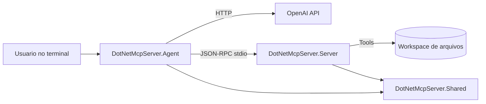

# DotNetMcpServer - AI Agent + MCP com .NET 10

[](https://github.com/SEU_USUARIO/dotnet-mcp-server/actions/workflows/ci.yml)
[](LICENSE)

Projeto completo de estudo e portfólio com **AI Agent** + **MCP (Model Context Protocol)**, implementado do zero em **.NET 10**.

A solução contém:
- Um **agente de IA em console** que conversa com o modelo e executa tool-calling.
- Um **MCP Server** via `stdio` (JSON-RPC com `Content-Length`) com ferramentas reais.
- Uma biblioteca **Shared** com contratos MCP/JSON-RPC reutilizáveis.
- Testes unitários para contratos e framing do protocolo.

## Objetivo do projeto

Este repositório foi pensado para:
- Servir como material de estudo de arquitetura de agentes.
- Demonstrar integração prática entre LLM + ferramentas externas.
- Ser um projeto apresentável em portfólio GitHub.

## Stack

- .NET SDK `10.0.x`
- C# (nullable habilitado)
- JSON-RPC 2.0 sobre `stdio`
- OpenAI Chat Completions API (tool-calling)
- xUnit para testes

## Arquitetura



### Fluxo resumido

1. O agente inicia e sobe o MCP Server como processo filho.
2. Faz handshake MCP (`initialize` + `notifications/initialized`).
3. Lista ferramentas com `tools/list`.
4. Envia pergunta do usuário para o modelo com o schema das tools.
5. Quando o modelo pede uma tool, o agente chama `tools/call`.
6. O retorno da tool volta para o modelo até obter resposta final.

## Estrutura do repositório

```text
.
├─ src/
│  ├─ DotNetMcpServer.Shared/       # Contratos JSON-RPC + MCP
│  ├─ DotNetMcpServer.Server/    # Servidor MCP (stdio)
│  └─ DotNetMcpServer.Agent/        # Agente de IA em console
├─ tests/
│  └─ DotNetMcpServer.Tests/        # Testes unitários
├─ DotNetMcpServer.sln
├─ DotNetMcpServer.slnx
└─ README.md
```

## Ferramentas MCP implementadas

1. `get_current_datetime`
2. `calculate_expression`
3. `read_text_file`
4. `append_study_note`

## Pré-requisitos

1. .NET 10 instalado (`dotnet --version`).
2. Chave de API da OpenAI.

## Configuração

### 1) Variável de ambiente obrigatória

No PowerShell:

```powershell
$env:OPENAI_API_KEY="sua-chave-aqui"
```

### 2) Ajustes opcionais

Arquivo: `src/DotNetMcpServer.Agent/appsettings.json`

- `openAI.model`
- `openAI.baseUrl`
- `mcp.arguments`
- `runtime.systemPrompt`

Também é possível sobrescrever por ambiente (veja também `.env.example`):
- `OPENAI_MODEL`
- `OPENAI_BASE_URL`
- `MCP_COMMAND`
- `MCP_ARGUMENTS`
- `MCP_WORKING_DIRECTORY`
- `MCP_WORKSPACE_ROOT`
- `OPENAI_TEMPERATURE`
- `AGENT_SYSTEM_PROMPT`
- `AGENT_MAX_TOOL_ITERATIONS`

## Como executar

Na raiz do repositório:

```powershell
dotnet restore src/DotNetMcpServer.Agent/DotNetMcpServer.Agent.csproj
dotnet restore src/DotNetMcpServer.Server/DotNetMcpServer.Server.csproj
dotnet build src/DotNetMcpServer.Agent/DotNetMcpServer.Agent.csproj
dotnet run --project src/DotNetMcpServer.Agent/DotNetMcpServer.Agent.csproj
```

No terminal do agente:
- digite perguntas normalmente.
- use `exit` para encerrar.

## Exemplos de prompts

- `Que horas são em America/Sao_Paulo?`
- `Leia o README.md e faça um resumo dos pontos principais.`
- `Calcule (1200 + 350) / 5`
- `Salve uma nota com o título "Estudo MCP" e o conteúdo "Revisar tools/list e tools/call"`

## Rodando testes

```powershell
dotnet test tests/DotNetMcpServer.Tests/DotNetMcpServer.Tests.csproj
```

## Como evoluir o projeto

Sugestões para continuar estudando:

1. Adicionar memória vetorial (RAG local).
2. Trocar o `stdio` por Streamable HTTP no MCP server.
3. Implementar autenticação e autorização por tool.
4. Adicionar observabilidade (logs estruturados + métricas).
5. Criar suíte de testes de integração Agent <-> MCP.

## Licença

Este projeto está licenciado sob a [MIT License](LICENSE).


